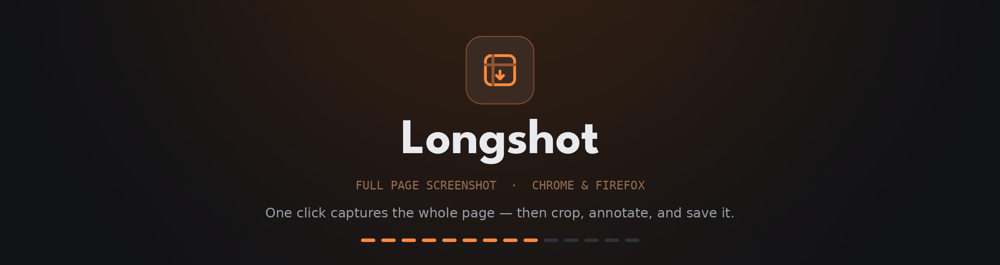

<h1 align="center">
  
</h1>

<p align="center">
  A browser extension (Manifest V3, Chrome and Firefox) that captures an entire web
  page in one click, then lets you crop, annotate, and save it as PNG, JPG, or PDF.
  <br>
  No account, no server, no uploads — everything happens in the browser.
</p>


## What it does

- **Full page capture** — scrolls the page, captures every screen, stitches them
  into one image (`Alt+Shift+P`)
- **Visible area capture** — just what is on screen (`Alt+Shift+V`)
- **Annotate** — arrow, line, rectangle, ellipse, freehand, text, numbered steps,
  highlight, blur, pixelate, black-out
- **Crop** with a thirds guide, undo/redo throughout
- **Right-click** for the editor's own menu rather than the browser's: copy,
  save, undo and zoom over the image; duplicate, restack, edit or delete over a
  mark, named for what it is
- **Save** as PNG, JPG, or PDF (one long page, or sliced into A4/Letter), or copy
  to the clipboard
- **Pages that fight back** — sticky bars are set aside after the first screen, a
  pre-scroll pass loads lazy images, and app-style inner scroll containers are
  detected instead of returning a single viewport
- **Pixel-exact stitching** — the saved file matches the browser's own screenshot
  pixel for pixel, at any display scale. Capture at 2× for text with twice the
  detail, and write PDFs losslessly when they are going to be read
- **App shells come out whole** — a page that scrolls an inner panel is captured
  with its frame: header above, sidebar carried down the side, status bar at the
  foot. Panels that scroll smoothly, run past the bottom of the window, or count
  right-to-left are all handled

## Languages

The interface ships in fourteen languages, chosen in the settings rather than
taken from the browser's own. Four of them — Arabic, Persian, Hebrew and Urdu —
lay the interface out right to left.

Each language is one file of plain strings in `src/shared/locales/`. To add
another, copy `en.js`, translate the values, and register it in the `LANGUAGES`
table in `src/shared/i18n.js`. `node tools/check-locales.mjs` then confirms every
catalogue carries the same keys with the same `{placeholders}`, and that nothing
in the interface asks for a string that does not exist.

## Install for development

```sh
git clone <this repo> && cd full-page-screenshot
python3 tools/make_icons.py     # only needed if icons/ is empty
```

Then open `chrome://extensions`, turn on **Developer mode**, choose **Load
unpacked**, and pick the repository root.

For Firefox, build the package first — the repository root carries the Chrome
manifest, and Firefox needs its own:

```sh
node tools/build.mjs --target=firefox
```

Then open `about:debugging` → **This Firefox** → **Load Temporary Add-on**, and
pick `dist/package-firefox/manifest.json`.

## Build a store package

```sh
node tools/build.mjs                    # Chrome Web Store
node tools/build.mjs --target=firefox   # addons.mozilla.org
node tools/build.mjs --target=all       # both
```

Each target writes `dist/longshot-<version>[-firefox].zip` plus the unpacked
`dist/package[-firefox]/` it was zipped from. Both ship identical code — only the
manifest differs, and only where it has to (Firefox runs the same module as an
event page and needs its own add-on id). Everything else is handled at runtime by
`src/shared/compat.js`.

The build refuses to package inline scripts, remote code, missing manifest
references, or host permissions — the things store review sends back.

## Tests

The smoke test loads the extension into a headless Chrome, captures a 5,460 px
fixture page, and checks the stitched result pixel by pixel: dimensions, band
order, the sticky header appearing exactly once, the floating badge dropping out
after the first screen, and PNG/PDF export. It then captures two app-shell
fixtures: one whose scrolling panel is taller than the window, checking that the
panel's out-of-reach tail is in the image and no unpainted band is left behind,
and one with furniture on every side, checking that the frame lands where the
page puts it and that no bare canvas survives anywhere.

A fourth fixture is a ruler: a gradient with a red rule every 100 px, captured
at 125% display scale and again at 2×. It counts the rules, measures the spacing
across every seam, and fails on a single unpainted row — which is what a stitch
that drops a fraction of a pixel between tiles leaves behind.

A fifth is an admin shell with a width floor, captured with 2× asked for: it
checks that the capture measures the squeeze, hands the zoom back, and reports
that it did.

Branded Google Chrome refuses `--load-extension`, so use a Chrome for Testing
build:

```sh
npx @puppeteer/browsers install chrome@stable --path /tmp/browsers
CHROME_BIN=/tmp/browsers/chrome/linux-*/chrome-linux64/chrome node tools/smoke-test.mjs
```

Two more checks need no browser at all:

```sh
node tools/check-locales.mjs                        # holds every language against English,
                                                    # key for key and placeholder for placeholder
npx web-ext lint --source-dir dist/package-firefox  # the linter AMO runs on submission
```

The Firefox lint has to come back with no errors. It keeps five warnings about
`innerHTML`, all of them assignments of string constants that ship inside the
package — icons, the progress card's markup, and interface strings from
`src/shared/locales/`. Page content only ever reaches a canvas, as pixels.
[`store/LISTING-FIREFOX.md`](store/LISTING-FIREFOX.md) § *Notes for reviewers*
has the paragraph that explains this to a reviewer.

## Releases

[`.github/workflows/ci.yml`](.github/workflows/ci.yml) packs both stores, lints
the Firefox package, and runs the smoke test on every push and pull request.

[`.github/workflows/release.yml`](.github/workflows/release.yml) does the same
and then ships. Tag the commit and both stores get the version:

```sh
git tag v1.0.1 && git push origin v1.0.1
```

The tag has to match `manifest.json` or the run stops before it builds anything,
and the smoke test has to pass before anything is uploaded. Run the workflow by
hand to publish to one store only, or to build a release without publishing.

Publishing needs six repository secrets. A missing pair skips that store rather
than failing the run, so one store can go live before the other is set up.

| Secret | Where it comes from |
| --- | --- |
| `CWS_EXTENSION_ID` | the item id in the Chrome Web Store developer dashboard |
| `CWS_CLIENT_ID`, `CWS_CLIENT_SECRET`, `CWS_REFRESH_TOKEN` | an OAuth client for the Chrome Web Store API |
| `AMO_JWT_ISSUER`, `AMO_JWT_SECRET` | <https://addons.mozilla.org/developers/addon/api/key/> |

AMO can only add versions to an add-on that already exists, so the first Firefox
upload has to go through the submission form by hand — once.
[`store/LISTING-FIREFOX.md`](store/LISTING-FIREFOX.md) is the runbook for it, and
after that a tag is the whole release. Chrome uploads publish themselves; drop
`--auto-publish` from the workflow to leave them as drafts.

The two store runbooks:

| Store | Listing copy and first submission |
| --- | --- |
| Chrome Web Store | [`store/LISTING.md`](store/LISTING.md), [`store/SUBMISSION.md`](store/SUBMISSION.md) |
| Firefox Add-ons | [`store/LISTING-FIREFOX.md`](store/LISTING-FIREFOX.md) |

## Published pages

The privacy policy both store listings point at is live at
**<https://longshot-privacy.surge.sh>**, served by [surge.sh](https://surge.sh)
straight from `docs/` — `index.html` plus the icon, no build step. Updating is one command from the repository root:

```sh
npx surge ./docs longshot-privacy.surge.sh
```

Keep `store/PRIVACY.md` in step with `docs/index.html`, and move the "Last
updated" date whenever the substance changes.

## Store assets

`tools/capture-ui.mjs` drives the real extension in headless Chrome and shoots
the UI — no mockups anywhere; `tools/make_store_assets.py` frames those shots
into the 1280×800 listing images and the promo tiles. Regenerate both whenever
the interface changes:

```sh
CHROME_BIN=/tmp/browsers/chrome/linux-*/chrome-linux64/chrome node tools/capture-ui.mjs
python3 tools/make_store_assets.py
```

That writes six numbered slides to `store/screenshots/`. The Chrome Web Store
takes five at most, so it gets `01`–`05`; AMO sets no practical limit and takes
all six.

The same script draws the brand images from `icons/icon-512.png` and the
League Spartan wordmark, so they cannot drift from the icon: the two promo
tiles, and `store/promo/banner.png` — the header at the top of this file, drawn
at 2× and shown at half so it stays sharp on a HiDPI screen. Changing the icon
means re-running `tools/make_icons.py` and then this.

## How the capture works

```
popup / shortcut / context menu
        │
        ▼
service worker ──── injects ───▶ content agent (src/content/capture.js)
        │                          plans the tile grid, scrolls, calms
        │                          sticky furniture, draws the progress card
        │  captureVisibleTab per step
        ▼
   editor tab ◀──── one tile per message over a port ────┘
        │           draws each tile as it arrives — nothing is buffered
        ▼
   annotate → export (PNG / JPG / PDF / clipboard)
```

The editor tab is opened *before* the capture starts, in the background, so tiles
stream straight into a canvas instead of piling up in the service worker. The
scale factor comes from the first tile's real width, which keeps HiDPI displays
and page zoom correct without guessing.

## Layout

| Path | What lives there |
| --- | --- |
| `manifest.json` | MV3 manifest — `activeTab` only, no host permissions |
| `src/background/` | Capture orchestration, commands, context menus |
| `src/content/` | The in-page agent: scroll planning, sticky handling, progress card |
| `src/editor/` | Stitching, annotation model, rendering, the right-click menu, export |
| `src/popup/`, `src/options/` | The two surfaces you click |
| `src/shared/` | Settings, message catalogues, file name templates, the PDF writer, browser compat shims |
| `docs/` | The published privacy policy page |
| `tools/` | Icons, store assets, build, smoke test, locale check |
| `store/` | Listing copy for both stores, privacy policy, generated brand and store images |
| `.github/workflows/` | CI on every push; release and publish on every tag |

## Licence

Proprietary — all rights reserved. See [LICENSE](LICENSE).

This is not an open source project. Installing Longshot from an extension store
lets you run it; it does not grant permission to copy, modify, or redistribute
the code. (An extension's JavaScript is readable by anyone who installs it —
Google's policy forbids obfuscating it — so the licence, not secrecy, is what
governs reuse.)
