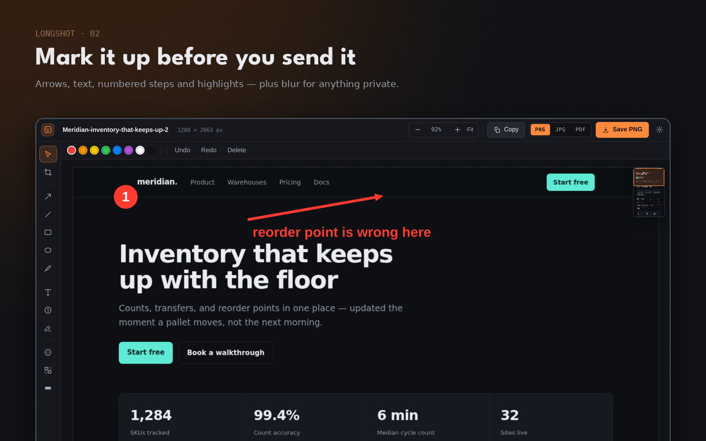

# Longshot — full page screenshot

A Chrome extension (Manifest V3) that captures an entire web page in one click,
then lets you crop, annotate, and save it as PNG, JPG, or PDF. No account, no
server, no uploads — everything happens in the browser.



## What it does

- **Full page capture** — scrolls the page, captures every screen, stitches them
  into one image (`Alt+Shift+P`)
- **Visible area capture** — just what is on screen (`Alt+Shift+V`)
- **Annotate** — arrow, line, rectangle, ellipse, freehand, text, numbered steps,
  highlight, blur, pixelate, black-out
- **Crop** with a thirds guide, undo/redo throughout
- **Save** as PNG, JPG, or PDF (one long page, or sliced into A4/Letter), or copy
  to the clipboard
- **Pages that fight back** — sticky bars are set aside after the first screen, a
  pre-scroll pass loads lazy images, and app-style inner scroll containers are
  detected instead of returning a single viewport

## Install for development

```sh
git clone <this repo> && cd full-page-screenshot
python3 tools/make_icons.py     # only needed if icons/ is empty
```

Then open `chrome://extensions`, turn on **Developer mode**, choose **Load
unpacked**, and pick the repository root.

## Build a store package

```sh
node tools/build.mjs                    # Chrome Web Store
node tools/build.mjs --target=firefox   # addons.mozilla.org
node tools/build.mjs --target=all       # both
```

Each target writes `dist/longshot-<version>[-firefox].zip` plus the unpacked
`dist/package[-firefox]/` it was zipped from. Both ship identical code — only the
manifest differs, and only where it has to (Firefox runs the same module as an
event page and needs its own add-on id). Everything else is handled at runtime by
`src/shared/compat.js`.

The build refuses to package inline scripts, remote code, missing manifest
references, or host permissions — the things store review sends back.

## Tests

The smoke test loads the extension into a headless Chrome, captures a 5,460 px
fixture page, and checks the stitched result pixel by pixel: dimensions, band
order, the sticky header appearing exactly once, the floating badge dropping out
after the first screen, and PNG/PDF export.

Branded Google Chrome refuses `--load-extension`, so use a Chrome for Testing
build:

```sh
npx @puppeteer/browsers install chrome@stable --path /tmp/browsers
CHROME_BIN=/tmp/browsers/chrome/linux-*/chrome-linux64/chrome node tools/smoke-test.mjs
```

## Published pages

The privacy policy the Chrome Web Store listing points at is live at
**<https://longshot-privacy.surge.sh>**, served by [surge.sh](https://surge.sh)
straight from `docs/` — `index.html` plus the icon, no build step. Updating is one command from the repository root:

```sh
npx surge ./docs longshot-privacy.surge.sh
```

Keep `store/PRIVACY.md` in step with `docs/index.html`, and move the "Last
updated" date whenever the substance changes.

## Store assets

`tools/capture-ui.mjs` drives the real extension in headless Chrome and shoots
the UI; `tools/make_store_assets.py` frames those shots into the 1280×800
listing images and the promo tiles. Listing copy, permission justifications, and
a submission checklist live in [`store/LISTING.md`](store/LISTING.md).

## How the capture works

```
popup / shortcut / context menu
        │
        ▼
service worker ──── injects ───▶ content agent (src/content/capture.js)
        │                          plans the tile grid, scrolls, calms
        │                          sticky furniture, draws the progress card
        │  captureVisibleTab per step
        ▼
   editor tab ◀──── one tile per message over a port ────┘
        │           draws each tile as it arrives — nothing is buffered
        ▼
   annotate → export (PNG / JPG / PDF / clipboard)
```

The editor tab is opened *before* the capture starts, in the background, so tiles
stream straight into a canvas instead of piling up in the service worker. The
scale factor comes from the first tile's real width, which keeps HiDPI displays
and page zoom correct without guessing.

## Layout

| Path | What lives there |
| --- | --- |
| `manifest.json` | MV3 manifest — `activeTab` only, no host permissions |
| `src/background/` | Capture orchestration, commands, context menus |
| `src/content/` | The in-page agent: scroll planning, sticky handling, progress card |
| `src/editor/` | Stitching, annotation model, rendering, export |
| `src/popup/`, `src/options/` | The two surfaces you click |
| `src/shared/` | Settings, file name templates, the PDF writer, browser compat shims |
| `docs/` | The published privacy policy page (see below) |
| `tools/` | Icons, store assets, build, smoke test |
| `store/` | Listing copy, privacy policy, generated store images |

## Licence

Proprietary — all rights reserved. See [LICENSE](LICENSE).

This is not an open source project. Installing Longshot from an extension store
lets you run it; it does not grant permission to copy, modify, or redistribute
the code. (An extension's JavaScript is readable by anyone who installs it —
Google's policy forbids obfuscating it — so the licence, not secrecy, is what
governs reuse.)
